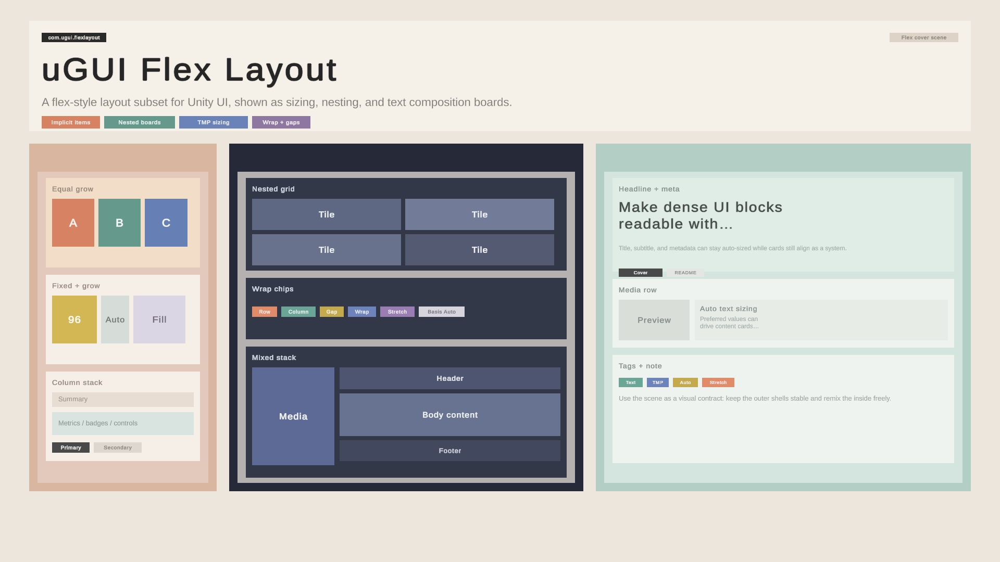

# UGUI FlexLayout

`com.ugui.flexlayout` 是一个面向 Unity UGUI 的 flex 风格布局包，用来驱动 `RectTransform` 层级的排布。

它实现的是适合 UGUI 的 flex 子集，重点放在 Unity 组件模型、编辑器行为和运行时重建流程上，而不是完整复刻 CSS。

## 组件模型

当前包提供四个核心组件：

- `FlexLayout`
  - 容器语义
  - 隐式子节点默认规则
  - dirty 标记与重建入口
- `FlexNode`
  - 自身尺寸策略
  - min / max
  - aspect ratio
  - relative / absolute
- `FlexItem`
  - 作为父容器子项时的 item 语义
- `FlexText`
  - 覆盖默认内容测量源，用于 `TextMeshProUGUI`

职责边界是固定的：

- `FlexLayout` 负责容器
- `FlexNode` 负责自身尺寸
- `FlexItem` 负责作为 item 时的主轴分配行为
- `FlexText` 只覆盖内容测量，不重定义整套布局语义

## 基本使用

常见组合如下：

- 父节点作为容器：挂 `FlexLayout`
- 节点需要显式控制自身宽高：挂 `FlexNode`
- 子节点需要控制 grow / shrink / basis：挂 `FlexItem`
- TMP 文本需要按文本内容测量：挂 `FlexText`

普通子节点不需要为了参与布局而全部挂组件。只有在默认行为不够时，才显式添加对应组件覆盖默认规则。

## 隐式子节点

没有挂 `FlexNode` / `FlexItem` / `FlexText` 的直接子节点，仍然会作为父 `FlexLayout` 的直接子项参与布局。

隐式子节点的规则分成两部分：

- `item` 侧默认值来自父 `FlexLayout`
- `node` 侧默认内容输入来自子节点自己的 `RectTransform`

这意味着：

- 不挂组件的子节点，默认也会被父布局参与主轴和交叉轴排布
- 只有当某个子节点需要不同的尺寸策略、item 行为或文本测量行为时，才需要显式挂组件

## 尺寸规则

`FlexNode` 的 `width / height` 支持：

- `Points`
- `Auto`
- `Percent`

语义如下：

- `Points`
  - 显式点值
- `Auto`
  - 统一表示“使用节点自己的内容尺寸”
  - 普通节点默认读取当前 `RectTransform`
  - `FlexText` 则改为读取文本测量结果
- `Percent`
  - 相对直接父 `RectTransform` 的该轴尺寸
  - 如果没有可用的父尺寸输入，则退回 `Auto`

作为 item 时：

- `flex-basis` 决定主轴基准
- 当 `flex-basis = Auto` 时，会回退到该节点主轴上的 `FlexNode` 尺寸策略

## Tracker 与控制权

布局系统通过 `DrivenRectTransformTracker` 管理自己拥有的 `RectTransform` 字段。

控制权规则是：

- in-flow 子节点的位置由父 `FlexLayout` 驱动
- 节点尺寸是否被驱动，取决于解析后的 `FlexNode` 规则
- 隐式子节点不是例外；只要当前布局规则要求驱动，就会进入 tracker
- 要手动编辑某个被布局控制的字段，必须先移除或禁用对应的布局控制来源

这和 Unity 自带 layout 组件的基本思路一致：谁拥有布局控制权，谁就负责写回对应字段。

## 运行时结构

当前运行时核心按阶段组织：

- `Collect`
  - 从 Unity 组件树读取 authoring 输入
- `Compute`
  - 进行 measure / allocate / arrange
- `Apply`
  - 把结果写回 `RectTransform`

在编辑器中，修改后会尽量立即刷新；在运行时，则通过统一的 dirty 入口调度重建。

## Samples

包内提供 `Canvas Prefabs` sample，包含多个 `1920x1080` 的 UGUI Canvas 预制体，可直接导入后作为布局起点或视觉参考使用。
